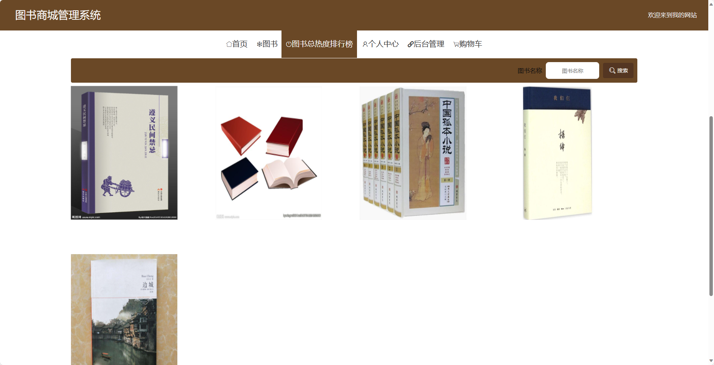
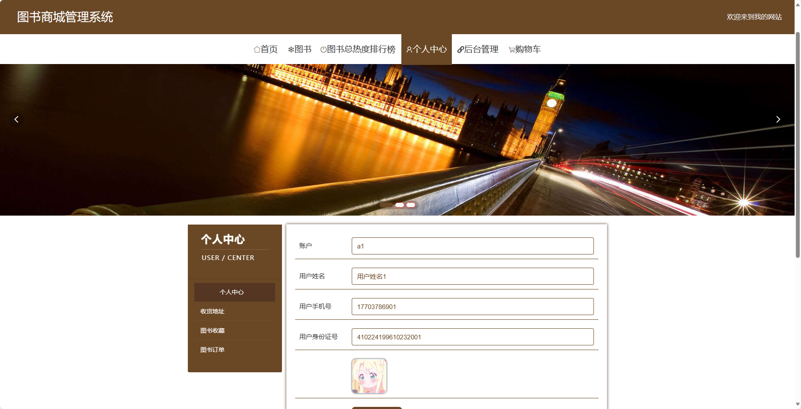

## 基于SpringBoot的图书商城管理系统(程序+报告)

- <b>完整代码获取地址：从戎源码网 ([https://armycodes.com/](https://armycodes.com/))</b>
- <b>技术探讨、资料分享，请加QQ群：692619798</b> 
- <b>作者微信：19941326836  QQ：952045282</b> 
- <b>承接计算机毕业设计、Java毕业设计、Python毕业设计、深度学习、机器学习</b>
- <b>选题+开题报告+任务书+程序定制+安装调试+论文+答辩ppt 一条龙服务</b>
- <b>所有选题地址 ([https://github.com/YuLin-Coder/AllProjectCatalog](https://github.com/YuLin-Coder/AllProjectCatalog)) </b>

## 项目介绍
基于SpringBoot的图书商城管理系统，系统包含两种角色：管理员、用户,系统分为前台和后台两大模块，主要功能如下。

### 【管理员】:
- 个人中心：管理个人信息。
- 基础数据管理：管理系统中的基础数据，例如图书分类、出版社信息等。
- 图书管理：管理图书信息，包括添加、编辑、删除图书等操作。
- 用户管理：管理用户账号信息，包括添加、编辑、删除用户等操作。
- 图书评价管理：管理用户对图书的评价和评论，包括审核和删除等操作。
- 图书收藏管理：管理用户对图书的收藏，包括查看收藏列表、取消收藏等操作。
- 图书订单管理：管理用户的图书订单，包括查看订单详情、确认发货等操作。
- 轮播图信息：管理系统的轮播图信息，包括添加、编辑、删除等操作。

### 【用户】:
- 个人中心：管理个人信息，包括订单记录、个人设置等。
- 图书管理：浏览和搜索图书信息，包括图书封面、作者、价格等。
- 图书评价管理：对已购买的图书进行评价和评论。
- 图书收藏管理：查看和管理已收藏的图书。
- 图书订单管理：查看和管理已购买的图书订单。

### 【前台】:
- 首页：展示图书商城的相关内容。
- 图书：浏览和搜索图书信息。
- 图书总热度排行榜：展示图书按照热度进行排名的榜单。
- 个人中心：管理个人信息，包括订单记录、个人设置等。
- 购物车：管理用户选购的图书，包括添加、删除、结算等操作。

## 项目技术
- 编程语言：Java
- 数据库：MySQL
- 项目管理工具：Maven
- 前端技术：HTML、CSS、JavaScript、Jquery、Vue
- 后端技术：Spring、SpringMVC、MyBatis

## 运行环境
- JDK版本：JDK1.8及以上
- 开发工具：IDEA、Ecplise、Myecplise都可以
- 数据库: MySQL5.7及以上
- Maven：maven3.0及以上
- Node：14.14.0及以上

## 运行截图

